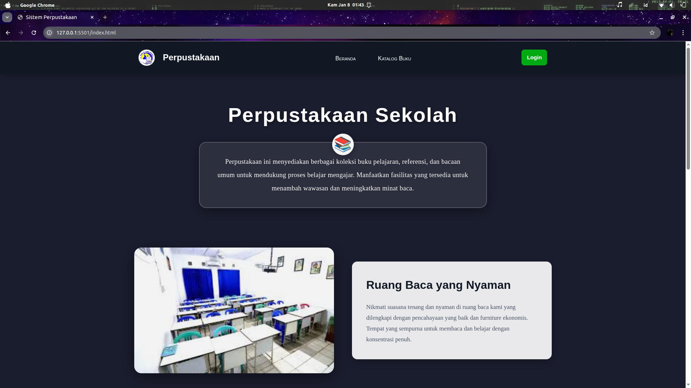
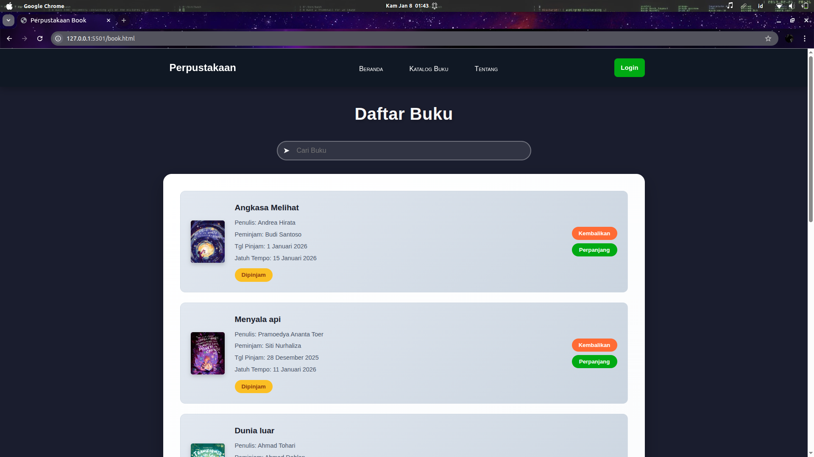
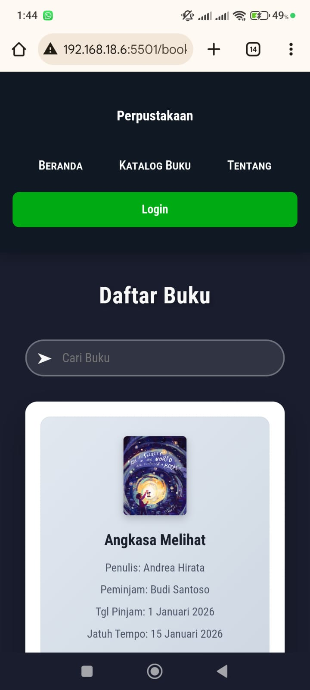

# Persiapan Sertifikasi - GHANI BLL

Repository ini berisi materi dan soal latihan untuk persiapan **Uji Sertifikasi Kompetensi (USK)** yang diikuti oleh siswa SMK TI Airlangga jurusan PPLG (Pengembangan Perangkat Lunak dan Gim).

Aplikasi web perpustakaan sederhana berbasis HTML, CSS, dan JavaScript
untuk latihan persiapan Sertifikasi Kompetensi (USK).

## ୧⍤⃝Identitas

- Nama : Ghani
- Sekolah : SMK TI Airlangga
- Jurusan : PPLG

## Tujuan

Materi ini dibuat untuk membantu siswa:

- memahami materi kompetensi yang diujikan
- berlatih soal-soal sesuai standar sertifikasi
- siap menghadapi ujian akhir kompetensi

## Isi Repository

Folder dan file dalam repository ini mungkin mencakup:

- `soal/` → kumpulan soal latihan
- `jawaban/` → kunci jawaban dari soal
- `materi/` → modul / ringkasan materi
- `assets/` → gambar atau media pendukung

## Cara Menggunakan

1. Clone repository:

```bash
  git clone https://github.com/SMK-TI-AIRLANGGA/persiapan-sertifikasi-GHANI-BLL.git
```

2. Buka folder project di `File Manager`
3. Jalankan index.html menggunakan browser
   atau gunakan Live Server di `VS Code`

## Menggunakan Bahasa


## Struktur Repository

```bash
perpus-baru/
│
├── fotoberanda/        # Gambar untuk halaman beranda
├── fotobuku/           # Gambar cover buku
├── fotosekolah/        # Gambar pendukung sekolah
│
├── index.html          # Halaman Beranda
├── book.html           # Halaman Katalog / Daftar Buku
├── about.html          # Halaman Tentang
├── login.html          # Halaman Login
│
├── styles.css          # File CSS utama (tampilan)
├── style.css           # File CSS kedua (login)
├── script.js           # JavaScript umum
├── book.js             # JavaScript khusus fitur buku & search
```

## Preview Aplikasi

### Tampilan Desktop

<p align="center">
  
  
</p>

---

### Tampilan Mobile

<p align="center">
  
  
</p>

## License

Project ini dibuat untuk keperluan pembelajaran.
